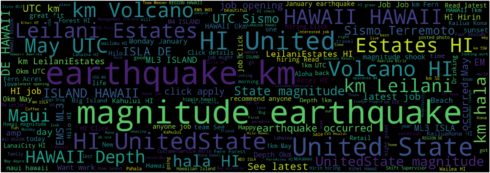
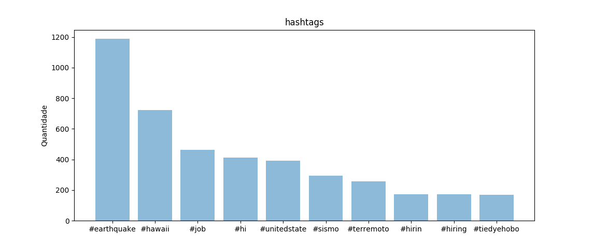

## ICV Disaster - Iniciação Ciêntifíca Voluntária
### Distância dos dias de início e fim da coleta

### Palavras mais utilizadas

### Scripts implementados para mineração de Tweets e análise dos dados.
                  

USGS real time monitoring [Hawaii] - https://on.doi.gov/2rySrnW
